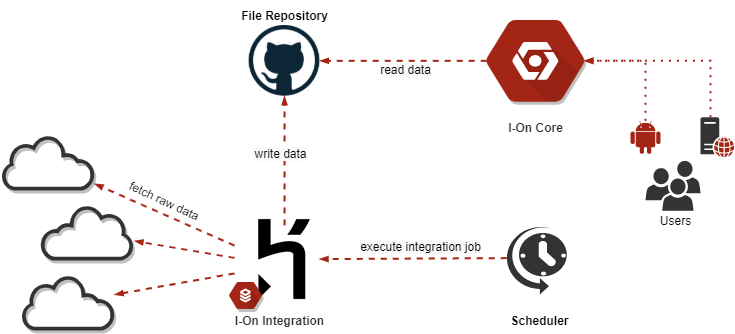

[](https://www.ionproject.org)

[](https://github.com/i-on-project/integration/blob/master/LICENSE)
[](https://github.com/i-on-project/integration/tags)
[](https://github.com/i-on-project/integration/actions?query=branch%3Amaster)
[](https://github.com/i-on-project/integration/commits/master)
[](https://github.com/i-on-project/integration/pulls/)
[](https://github.com/i-on-project/integration/issues/)

[](https://github.com/i-on-project/integration/graphs/contributors/)

## About the project
[I-On](https://github.com/i-on-project) is an open source academic information aggregation and distribution system. 

Academic information such as class schedules or academic calendars is often scattered throughout each institution's webpage, departmental sections or its Learning Management System and can often times make it hard for students to navigate and find what they need.

**I-On**'s purpose is to collect and present this data in a simple and meaningful way and provide a set of **functionalities to make students' lives easier**, such as **building course schedules** or **keeping track of tests and exams**.

**I-On _Integration_**'s purpose is to **obtain and process** all of this **unstructured data**, normalize and present it in a **consistent and structured format** that is institution agnostic so it can be used by other project components.

### Architecture



**I-On Integration** uses *batch processing* techniques to acquire and process all unstructured data and write it to the common **File Repository** (a Git repo whose sole purpose is to host this data).

The **Scheduler** component, as the name suggests, is responsible for periodically triggering job executions through Integration's Web API (not yet available).

### Built With
Presently I-On integration is built using the following main frameworks and technologies:
- [Spring Batch](https://spring.io/projects/spring-batch) for **batch processing** and job maintenance
- [Spring Boot Starter Web](https://mvnrepository.com/artifact/org.springframework.boot/spring-boot-starter-web) for it's **Web API** (not yet available)
- **Github** for **version control**, **CI/CD** pipelines and to host the **File Repository** in a separate [Github Repo](https://github.com/i-on-project/integration-data)
- [Kotlin](https://kotlinlang.org/) as the main programming language
- [Docker](https://www.docker.com/) for **containerization** of deployed artifacts

## Getting Started
Getting your own copy of **I-On Integration** running locally while not difficult can be tedious if done manually so we've provided a simple **Docker Compose** script to simplify it.

### Requirements

* [Docker](https://www.docker.com/)
* [Docker Compose](https://docs.docker.com/compose/install/) (**Note**: Already included in **Docker Desktop for Windows**)
* [Git](https://git-scm.com/) (Optional) to clone the repository, although you can also **download it as a zip file** from the top of this page

### Running with Docker Compose
Navigate to the **directory** in your local file system where you've chosen to place the source code in and, using your favorite **terminal**, run the following command: 
```
docker-compose up
```
This mode will run all the application containers and bind **their output to your standard output**. If you want to run them in the **background** simply add the **detach** flag to the command:
```
docker-compose up -d
```

The **first time you run the app will take longer than usual** as Docker downloads all required images from the remote repository. These are then **cached** locally and will be available for following builds, making them faster.

By **default** the app containers will be accessible via the following ports:
- **Git server**: Port **8080**
- **PostgreSQL Database**: Port **5432**

If you wish to change these values please refer to the [Customizing Containers](#customizing-containers) section.

On Windows 10 you may see a **warning** about poor performance due to filesharing to a WSL container. This is due to the fact that we make use of [Docker Bind Mounts](https://docs.docker.com/storage/bind-mounts/) to share the necessary server files.


#### Using the containerized database
While the Integration app will be able to connect to the database out of the box without any human intervention you might also be interested in connecting directly to run your own queries.

You can use your favorite **SQL client** to connect to the containerized database just as you would for any other database server.

The **default** JDBC connection string is:
```
jdbc:postgresql://ion-db:5432/ion_integration
```

Or, if you're using a client that supports PostgreSQL Drivers (like [DBeaver](https://dbeaver.io/)) you can simply connect to a PostgreSQL destination with the following parameters:
- **Host**: localhost
- **Port**: (SQL_PORT in .env file)
- **Database**: (SQL_DATABASE in .env file)
- **Authentication**: Database Native
- **Username**: (SQL_USER in .env file)
- **Password**: (SQL_PASSWORD in .env file)

#### Using the containerized Git Server
The Git server currently deployed for local development is based on the [GitBucket](https://github.com/gitbucket/gitbucket) image which should be pretty familiar and intuitive to anyone with experience using **GitHub**.

It's Web front-end can be accessed by pointing your browser to localhost:8080 (default port, see the [Customizing Containers section](#customizing-containers) if you need to use a different port value).

##### Git Credentials
The server is deployed with a single **account** that can be accessed by entering `root` for both username and password fields.

### Customizing containers
While the environment works out of the box for most setups you may run into **port binding issues** if you're already using any of the default ports described in the [Running with Docker Compose section](#running-with-docker-compose).

These ports are configured from **Docker environment variables** and their preset values can be viewed by running the `docker-compose config` command or by reading the [.env](.env) file (which is a simple list of key-value pairs). Simply edit the **.env** file with the port values you wish to use and you're good to go.

**Note**: All port binding commands in docker use the `HOST:CONTAINER` format so, for example, the binding `1337:80` would bind the **1337 port** on the **host** machine to the **80 port** inside the **container**.

The default database, username and password are also customizable through the **.env** file.

**Note**: If **changing the default port** (8080) for the local Git Server you **must also update the `GIT_SERVER_ADDRESS`** variable in the [.env](.env) file to the new port value.

#### Using a remote Github repository
You can also setup your local environment to write its output files into a remote Git Repository of your choosing. 

To do this you need to configure three environment variables in the **.env** file:
- `GIT_SERVER_ADDRESS`: The address of the repository (i.e. https://github.com/i-on-project/integration-data)
- `GIT_BRANCH`: The branch to write to (i.e. `staging`)* 
- `GIT_USER`: A valid Github personal access token (see [Creating a personal access token](https://docs.github.com/en/github/authenticating-to-github/creating-a-personal-access-token)).
- `GIT_PASSWORD`: Should be left **blank** as the Token provided in the previous item will be used for authentication.

After configuring the **.env** file with these variables your app will be ready to commit and push to your newly configured repository after the next restart. At this point you can also bring down the local Git Server container.

`*` **NOTE:** The branch **must** exist in the remote repository, otherwise the app will default to the `master` branch.

### Stopping and removing the environment
If you are running in **attached** mode (without the `-d` flag) you can use `Ctrl + C` to stop all containers **gracefully** or, if you're in a hurry (or a container is not stopping on its own) you can press `Ctrl + C` a **second time** to **force shutdown**.

In **dettached mode** you can stop all containers with the `docker-compose stop` command.

Note that this will only **stop** the containers.

If you wish to **remove** all the containers you have to use the `docker-compose down` command. This will **not** remove images or volumes.

To also **remove all images** you can use `docker-compose down -rmi all`.

To **remove created volumes** (which are used to persist data across different containers) you can use the `docker-compose down -v`. This might be **useful if you wish to reset the database** as it relies on a volume to persist its data.

## Documentation

[Check wiki for additional information](https://github.com/i-on-project/integration/wiki)
