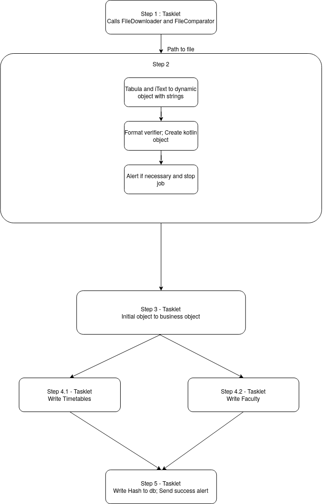

# ISEL Timetable Job Architecture

## Objectives of the present document

This document aims to introduce how Spring Batch is used in ISEL timetable job extraction process.
There is a small number of concepts that need to be introduced in advance relating to the Spring Batch Framework, its architecture and its domain specific language.

## Spring Batch Framework Architecture

Spring Batch is a framework used to abstract the common pieces used in batch applications, maximizing code reuse and minizing the amount of boilerplate code written.
In order to acchieve this, it has three layers - application, core and infrastructure. Wrapping the remaining two is the application layer, which consists of custom code and configuration used to build new batch processes. It is at this level that developers can intervene to build new batch jobs.
The core layer contains the interfaces that define the batch domain (e.g. JobLauncher, Job, Step). The infrastructure layer handles reading and writing to files and databases in addition to what to do when a job is retried after failure.
Embedded in Spring Batch by default are functionalities that are critical to any enterprise batch system, including the ability to retry a step after failure and keep the state of a job for re-execution.

## Domain Specific Language

The Spring Batch Documentation has a section on [Domain Specific Language](https://docs.spring.io/spring-batch/docs/current-SNAPSHOT/reference/html/domain.html). Most important to the present context are the concepts of `Job`, `Step`, `ItemReader`, `ItemProcessor` and `ItemWriter`.

Following is a summary of the concepts that are relevant in order to understand this document:

* `Job` - A process that executes from start to finish without interruption or interaction, consisting of one or more `steps`. It can have associated retry logic;
* `Step` - Independent and sequential phase of a batch job;
* `Chunk` - Fixed amount of items;
* `ItemReader` - Abstraction that represents `Step` input, per item;
* `ItemProcessor` - Abstraction that represents `Step` processing logic, associated to the domain of the application
* `ItemWriter` - Abstraction that represents `Step` output, per item, or per chunk.

## Representation of the timetable extraction as a Finite State Machine
The following diagram shows the sequence of actions necessary to complete the timetable extraction process. This is meant as a first approach to what are possible states within the process and their sequence. Note that there is no direct correspondence between each state of the finite state machine the steps within the job.

## Job Architecture
With Spring Batch we can configure a Job as a sequence of ordered steps. A step can consist of a tasklet (a more flexible piece with no necessity of configuring readers and writers) or a step based on chunks wich will read and process a fixed number of items and write once. It has associated mandatory ItemReader and ItemWriter definitions and an optional ItemProcessor.

The following diagram presents the sequence of steps included in the ISEL timetable extraction job:

Step 1 makes sure that that the timetable document is reachable in the URL specified in the configuration document (for more information on the document, visit [this]() page), and that it wasn't parsed in the past. The second step verifies that the format of the file is as expected. This is relevant since the extraction process strongly depends on it. Next, step 3 maps the verified object to a business object, more suited to the upload. Step 4 is comprised of two tasklets that are executed in parallel, which upload timetable and faculty information to I-On Core. Step 5 updates the database with the hash of the parsed file and notifies watchers of success.

### Step 1 - Download and Compare
Given that the timetable extraction job is dependent on information that is not controlled by the I-On Integration project, namely the ISEL timetable PDF, we need to make sure the document is in the designated location. Also, we don't want to send information that is already present in I-On Core. This step downloads the pdf document, (most likely from ISEL's website, but the location is configurable through the configuration document) and writes it to the local filesystem. It calculates a hash of the file. Then it reads the value of the hash of the document used in the last time the job ran successfully. Assuming a non-broken cryptographic hash and no collisions, if the two hashes are the same, then we know that the document content is certainly the same. In that case, the job does not proceed, as the extracted information is already present in I-On Core. On the other hand, if the saved hash is different from the one just calculated, then the file contents have changed since the last run of the job. Because the integration project doesn't save state, this is a fairly inexpensive way of avoiding processing repeated information. It is suited to this document in particular, since it is not expected that it should change frequently. It is normally posted in the start of the semester. There may be an isolated change in the following weeks, but then the document persists until the end of the semester.

### Step 2 - Verify format
The second step is configured with a reader, processor and writer. The chunk size is equal to one, as an input item contains information for all the document.
The input item is a dynamic object with two string arrays, one for the output of Tabula and one for non-tabular information, obtained with iText. The arrays contain as many elements as the number of pages in the pdf.

The reader iterates through the pages of the document, enriching the dynamic object. The processor verifies the format. It does not need to verify more than one page. It also maps the dynamic object to a kotlin object with a format more suited to the extraction itself. Then this object will be published to a state instance that is declared in the configuration file and injected in the processor of step 2 and the tasklet of step 3.

Communicating state across steps in a job can be done via the JobExecutionContext, but this has limited capability, deeming it not suitable to this use case.
Maintaining state only in memory is sufficient as we don't need the data available outside the scope of a job execution. Also, if we had a database for this we would have to deal with the overhead of reading from and writing to it. Having chunk size equal to 1 enables us to atomically update the inter-step state object.

The writer of the present step is a no-op if the format of the source document is correct. But if the format is not, then all configurated alerts are generated and the job is stopped.

### Step 3 - Mapping
From the data generated in step 2, step 3 builds business objects that have type compatibility with what will be sent to I-On Core. Then it makes this information visible to a reference that is shared with step 4 declared in the configuration class and injected to both this tasklet and the ones in step 4.

### Step 4 - Upload to I-On Core
This step is comprised of two parallel tasklets. One of them uploads timetable information, one *class-section set* at a time to I-On core, and the other uploads faculty with the same granularity.

### Step 5 - PostUpload
As the job approaches termination, after the information was successfully extracted and uploaded, we register in a database the hash of the succesfully parsed document. This is done in order to prevent wasting time, memory and processing capabilities by running the job again with the same timetable document as input.

Finally, someone in charge of job supervision will be notified of success. As is the case with failure notification, the configuration file specifies who to notify in this case.

## Retry capabilities
To be able to use the retry mechanism embedded in Spring Batch, all that need to be done is configuring a step using StepBuilderFactory, call the faultTolerant method of [SimpleStepBuilder](https://docs.spring.io/spring-batch/docs/current/api/org/springframework/batch/core/step/builder/SimpleStepBuilder.html) and specify the retry limit and the Exceptions upon which retry is attempted.
