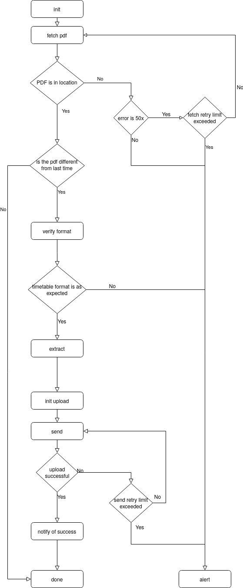

# ISEL Timetable Job Architecture

## Objectives of the present document

This document aims to introduce how Spring Batch is used in ISEL timetable job extraction process.
There is a small number of concepts that need to be introduced in advance relating to the Spring Batch Framework, its architecture and its domain specific language.

## Spring Batch Framework Architecture

Spring Batch is a framework used to abstract the common pieces used in batch applications, maximizing code reuse and minizing the amount of boilerplate code written.
In order to acchieve this, it has three layers - application, core and infrastructure. Wrapping the remaining two is the application layer, which consists of custom code and configuration used to build new batch processes. It is at this level that developers can intervene to build new batch jobs.
The core layer contains the interfaces that define the batch domain (e.g. JobLauncher, Job, Step). The infrastructure layer handles reading and writing to files and databases in addition to what to do when a job is retried after failure.
Embedded in Spring Batch by default are functionalities that are critical to any enterprise batch system, including the ability to retry a step after failure and keep the state of a job for re-execution.

## Domain Specific Language

The Spring Batch Documentation has a section on [Domain Specific Language](https://docs.spring.io/spring-batch/docs/current-SNAPSHOT/reference/html/domain.html). Most important to the present context are the concepts of `Job`, `Step`, `ItemReader`, `ItemProcessor` and `ItemWriter`.

Following is a summary of the concepts that are relevant in order to understand this document:

* `Job` - A process that executes from start to finish without interruption or interaction, consisting of one or more `steps`. It can have associated retry logic;
* `Step` - Independent and sequential phase of a batch job;
* `Chunk` - Fixed amount of items;
* `ItemReader` - Abstraction that represents `Step` input, per item;
* `ItemProcessor` - Abstraction that represents `Step` processing logic, associated to the domain of the application
* `ItemWriter` - Abstraction that represents `Step` output, per item, or per chunk.

## Representation of the timetable extraction as a Finite State Machine
The following diagram shows the sequence of actions necessary to complete the timetable extraction process. This is meant as a first approach to what are possible states within the process and their sequence. Note that there is no direct correspondence between each state of the finite state machine the steps within the job. This representation also omits that after the source file (ISEL timetable PDF) is successfully fetched and identified as a new document with a valid format, the extraction itself can be divided in two parts (tabular and non-tabular information) and parallelized.

## Job Architecture
With Spring Batch we can configure a Job as a sequence of ordered steps. A step can consist of a tasklet (a more flexible piece with no necessity of read/write logic) or a step based on chunks wich will read, process and write a fixed number of items with associated ItemReader, ItemProcessor and ItemWriter definitions.

One of the limitations of tasklets is that they don't enable passing state to future tasklets whithin the step in the seamless way that the chunk-based definition of steps can. In order to do this, StepExecutionContext has to be used, which has limitations in terms of the amount of data it suports (65kb).

Passing state between steps requires the promotion of a key-value pair from the StepExecution Context to the Job ExecutionContext. ExecutionContext is designed to share small quantities of data between steps and not to act as the main channel of information flow across a batch application.

The following diagram presents the sequence of job actions and their dependencies. Actions are classified according to type : Read, Process or Write.

In this job there is a clear read, process, write sequence. There is no need to read and transform data after it has been written. There is only one read-process-write cycle. The timetable extraction requires reading from one source, chaining processors, processing in different ways based on the type received and writing to more than one location different routes of the i-on core http API. For these reasons, a suitable solution is to define a single-step job.

Processors can be chained using CompositeItemProcessor.

Different processors for the same input data can be executed based on developer defined criteria using BackToBackPatternClassifier.

In order to write to multiple locations, we can use ClassifierCompositeItemWriter.

## Retry capabilities
To be able to use the retry mechanism embedded in Spring Batch, all that need to be done is configuring a step using StepBuilderFactory, call the faultTolerant method of [SimpleStepBuilder](https://docs.spring.io/spring-batch/docs/current/api/org/springframework/batch/core/step/builder/SimpleStepBuilder.html) and specify the retry limit and the Exceptions upon which retry is attempted.