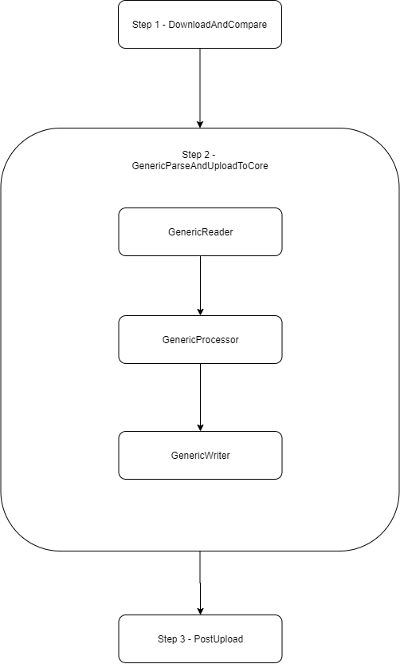

# Generic Batch job

During the development stage of the first phase of I-On Integration, it was acknowledged that importing information from external systems into I-On had some common elements, regardless of what sort of data was at hand.

The team realized that having a custom logic, made from scratch for each batch job would lead to a hard to maintain solution, which would also be overly complex and too cumbersome to extend.

Apart from minimizing maintenance overhead and amount of code written, we also wanted that people not associated with the project could be producers of information. This is primarily a practical requirement, as the project does not have a back-office. We went over the available formats, having picked out yaml, as it is human-readable.

From these realizations came the idea of developing a generic batch job, that would use the same code base to import information regarding academic calendar, exam schedule and timetable. Apart from these categories, the generic job would should be easily expanded to support importing new information from a yaml file.

The generic batch job should also be configurable, as the isel timetable batch job, via a configuration document.

## Common building blocks

The common building blocks of most importing operations that we identified include:

- Downloading a file from an external source
- Mapping the file to a kotlin object in memory
- Transforming this tentative model to a format that I-On Core can receive
- Sending the payload to I-On Core in a format previously agreed upon

## Configuring the generic batch job

The generic batch job is configurable through a file with the extension .properties. The following properties are accepted:

| Property | Description |
|----------|-------------|
| srcRemoteLocation | Url of the timetable pdf to be used on the job. |
| alertRecipient  | Email of the point-of-contact to notify about job outcome |
| jobType  | Category of information to be exported: EXAM_SCHEDULE, ACADEMIC_CALENDAR or TIMETABLE (Currently not supported)|

The application starts an instance of the generic batch job for each file in the subfolders of src/main/resources/config/generic. The parameters passed for each job instance are the properties contained in a file of that directory.

## From the blocks to the generic batch job

As the common stages were already present in the first batch job that was developed, the ISEL timetable batch job, some of the code was reused, which sped the development process.

Examples of code reuse are the DownloadAndCompareTasklet and the PostUploadTasklet. The first downloads a file, verifies that its format complies with the configured rules, and before saving its contents to the local file-system, compares its hash to that of the file the job successfully executed last time with. The PostUploadTasklet records a hash saved to the execution context and sends a success e-mail to a person responsible for overseeing the importing process.

The abstract building blocks of the generic batch job were materialized in the sequence of steps outlined in the following diagram:

 

In step 1, the DownloadAndCompareTasklet is used, as was stated. Step 2 has reader, processor and writer which were called Generic, because they are the same for each jobType, although with different behavior. Supported job types are ACADEMIC_CALENDAR, EXAM_SCHEDULE. The TIMETABLE is defined, but a yaml file was not defined and the transformation logic was not implemented.

According to jobType, a Factory class is obtained for parsing the yaml file. Jackson is used to de-serialize yaml. A yaml file was defined for each job type. Examples of these files which are used in the staging environment can be found in the [sources repository](https://github.com/i-on-project/integration-sources).

The factory class yields an object that implements the interface InternalModel. This interface has the virtual method toCore that transforms an instance of InternalModel to a CoreModel instance, that is suited to being sent to I-On Core. This transformation is performed in the process phase of the step. More details on the transformation from InternalModel to CoreModel are provided in the following section.

The writer of the second step will deserialize the CoreModel object. After retrieving the i-on core address from the app properties, it sends the payload to the specified route. A similar retry logic to what was implemented in the ISEL Timetable Batch job is in place. Even though the logic is quite the same, code could not be reused because the context of the first was a tasklet, which execute method returns RepeatStatus.

In a tasklet, returning RepeatStatus.CONTINUABLE triggers calling once again the execute method. In the context of a Writer, which method write returns void, that out-of-the-box repeating capability is not in place. However, placing the retry logic inside a while loop has the same behaviour.

A Core service abstraction had been developed in the context of the ISEL Timetable Batch job for sending information to Core. It was completely reused. Two new methods were added: pushCoreTerm to send academic calendar one term at a time, and pushExamSchedule to send all the exams for a school in one semester. However, these two methods call a lower-level method that was already developed for the first job.

Finally, step 3 of the generic batch job is defined in the PostUploadTasklet, which is already covered in this section. Further details on this tasklet can also be found in the ISEL Timetable Batch Job architecture document.

## Transforming Internal Model to Core Model

In this section, we will go into more detail about the conversion process between internal model - the model that a factory returns - and the CoreModel - the model that InternalModel can convert to, and that is best suited for sending to I-On Core. First we will go over the academic calendar and then we'll cover the exam schedule.

### Academic Calendar

I-On core receives academic calendar information one term at a time. Fortunately, that is also the format in which the information is layed-out in the academic calendar yaml file. The only difference is in what sort of elements are present in a term object. For the integration internal model, which for the present case is the same that is on the yaml file, there are different sorts of events in the term object. Each term has details - class begin and end dates for the different curricular semesters -, evaluations - which can include lectures or not, by way of a boolean value -, interruptions and other events - typically administrative deadlines.

A Term object for core however, identifies school, calendarTerm, begin and end date, language and a list of intervals. The begin and end dates for the semester are the minimum and maximum dates of its intervals. An interval, apart from begin and end date, carries a name. Optionally, it also has curricularTerm (e.g. 1-6 in a 3-year undergraduate degree), categories - which is a list that can take up the values in the [I-On Core documentation](https://github.com/i-on-project/core/blob/master/docs/api/write/insertClassSectionEvents.md#constants) - and excludes, which is also a list of identifiers defined in the same section. Excludes signals to Core that there cannot be events of the specified type in that interval.

The transformation process is relatively straightforward. We need to calculate begin and end date of the term, as was already stated. Start dates cannot be after end dates. If there is a period of evaluations during lectures, they are of type lecture and exam, if not they are only of type exam. When a period of evaluations is not during lectures, it excludes lectures. Interruptions also exclude lectures. The details events are of type lectures, as they are by definition periods in which classes occur.

### Exam Schedule

The exam schedule core model was based on the timetable model. In the timetable model, the events sent were recurrent events, whereas exams are non-recurrent events.

Apart from school and programme information, a CoreExamSchedule object has calendarTerm, language and a list of exam events. Exam events are grouped by a label that is the acronym of the course the exam refers to. As was the case with the academic calendar events, start date cannot be after end date. The fiels start date and end date are date time, as the hour of the exam is relevant.

## Adding a new job type to the generic batch job

Defining a new flow for the generic batch job requires defining a new JobType enum, defining an internal model factory in GenericFactory.getFactory, defining an internal model implementation, including the toCore method. The Writer also needs intervention, namely adding a case to a when expression in mapJobTypeToUploadType, specifying the method of core service that should be called for upload. Developing a new method in core service for uploading the new Core Model class instance.
